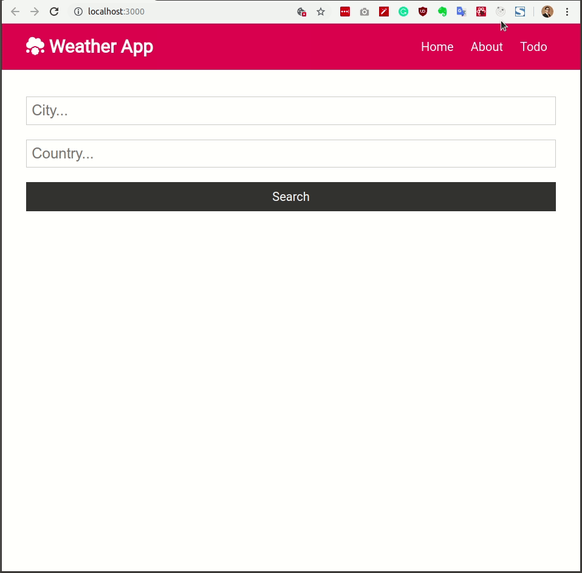

# WORKSHOP REACTJS

### Author: Vinh Hoang

### Date : TBD

## Agenda

- [x] Tổng quan về Reactjs
- [x] Tổng quan về React Weather App
- [x] Setup môi trường phát triển
- [x] Hello World App
- [x] Xây dựng các components:
  - [x] Navbar component
  - [x] About component
  - [x] Home component
  - [x] Weather component
  - [x] Fetch Weather API
- Todo
  - [ ] Deploy lên netlify
  - [ ] Xử lý các trường hợp đặt biệt
  - [ ] Thêm các UI như spinner, alert

### Tổng quan về React

### Some slides

[React Overview](http://coenraets.org/present/react)

### JSX trong React

ReactJS là một thư viện JavaScript được phát triển bởi Facebook nhằm xây dựng giao diện người dùng(UI).

JSX là một phần quan trọng trong ReactJS. JSX giống như một syntax extension giúp code trở lên dễ mượt và dễ đọc hơn.

JSX = Javascript + XML. Nó transform cú pháp dạng gần như XML về thành Javascript. Giúp người lập trình có thể code ReactJS bằng cú pháp của XML thay vì sử dụng Javascript. Các XML elements, attributes và children được chuyển đổi thành các đối số truyền vào React.createElement.

Cú pháp để sử dụng JSX khá đơn giản:

```jsx
<JSXName JSXAttributes>....</JSXName>
```

Khi khai báo 1 cú pháp JSX như sau:

```jsx
<MyButton color='blue' shadowSize={2}>
  Click Me
</MyButton>
```

Nó sẽ được compile sang JS như sau:

```js
React.createElement(MyButton, { color: 'blue', shadowSize: 2 }, 'Click Me');
```

MORE:

[JSX In Depth](https://reactjs.org/docs/jsx-in-depth.html)

[Getting Started with React and JSX](https://www.sitepoint.com/getting-started-react-jsx/)

### Tổng quan về React Weather App

- Single page app
- Sử dụng Open Weather APi



### Setup môi trường phát triển

### Cài đặt Nodejs và npm

Tại Ubuntu 18.04, mở Terminal và dùng câu lệnh sau để cài đặt

```
sudo apt update
sudo apt install nodejs
```

Dùng câu lệnh sau để kiểm tra:

```
nodejs --version
```

```
Output:
v8.10.0
```

### Cài đặt Visual Studio Code

Cài đặt VS Code thông qua Ubuntu Software

// Thêm hình ảnh VS Code

### Cài đặt các extensions cần thiêt

Mở phần Extensions trong Visual Studio Code, tìm và cài các extensions sau:

- ES7 React/Redux/GraphQL
- Prettier - Code formatter
- Bracket Pair Colorizer

Thêm các config trong file `settings.json` như sau:

```json
{
  "editor.formatOnSave": true,
  "prettier.jsxSingleQuote": true,
  "prettier.singleQuote": true,
  "emmet.includeLanguages": {
    "javascript": "javascriptreact"
  }
}
```

### Hello World App

Trước tiên, cài package `create-react-app` mức global từ npm .

```
npm install create-react-app -g
```

Dùng lệnh sau để khởi tạo project và launch app server

```
npx creact-react-app react-weather-app
cd react-weather-app
npm start
```

Remove các file không cần thiết: `serviceWorker.js`, `index.css`, `App.test.js`, `logo.svg`

Lưu ý remove các components không cần thiết trong file `index.js`

Thay thế code trong `App.js` bằng code sau:

```js
import React from 'react';
import './App.css';

function App() {
  return (
    <div className='App'>
      <h1>Hello World</h1>
    </div>
  );
}

export default App;
```

MORE:

[create-react-app](https://github.com/facebook/create-react-app)

---

### Xây dựng các components

### Navbar component

Tạo folder `components` để chứa tất cả các components của App

Inclue style trong file `App.css`

```css
@import url('https://fonts.googleapis.com/css?family=Roboto');

/* Global Styles */
:root {
  --primary-color: #dc3545;
  --dark-color: #333333;
  --light-color: #f4f4f4;
  --danger-color: #dc3545;
  --success-color: #28a745;
}

* {
  box-sizing: border-box;
  margin: 0;
  padding: 0;
}

body {
  font-family: 'Roboto', sans-serif;
  font-size: 1rem;
  line-height: 1.6;
  background-color: #fff;
  color: #333;
}

a {
  color: var(--primary-color);
  text-decoration: none;
}

a:hover {
  color: #666;
}

ul {
  list-style: none;
}

img {
  width: 100%;
}

/* Utilities */
.container {
  max-width: 1100px;
  margin: auto;
  overflow: hidden;
  padding: 0 2rem;
}

/* Text Styles*/
.x-large {
  font-size: 4rem;
  line-height: 1.2;
  margin-bottom: 1rem;
}

.large {
  font-size: 3rem;
  line-height: 1.2;
  margin-bottom: 1rem;
}

.lead {
  font-size: 1.5rem;
  margin-bottom: 1rem;
}

.text-center {
  text-align: center;
}

.text-primary {
  color: var(--primary-color);
}

.text-dark {
  color: var(--dark-color);
}

.text-success {
  color: var(--success-color);
}

.text-danger {
  color: var(--danger-color);
}

.text-center {
  text-align: center;
}

.text-right {
  text-align: right;
}

.text-left {
  text-align: left;
}

/* Center All */
.all-center {
  display: flex;
  flex-direction: column;
  width: 100%;
  margin: auto;
  justify-content: center;
  align-items: center;
  text-align: center;
}

/* Cards */
.card {
  padding: 1rem;
  border: #ccc 1px dotted;
  margin: 0.7rem 0;
}

/* List */
.list {
  margin: 0.5rem 0;
}

.list li {
  padding-bottom: 0.3rem;
}

/* Padding */
.p {
  padding: 0.5rem;
}
.p-1 {
  padding: 1rem;
}
.p-2 {
  padding: 2rem;
}
.p-3 {
  padding: 3rem;
}
.py {
  padding: 0.5rem 0;
}
.py-1 {
  padding: 1rem 0;
}
.py-2 {
  padding: 2rem 0;
}
.py-3 {
  padding: 3rem 0;
}

/* Margin */
.m {
  margin: 0.5rem;
}
.m-1 {
  margin: 1rem;
}
.m-2 {
  margin: 2rem;
}
.m-3 {
  margin: 3rem;
}
.my {
  margin: 0.5rem 0;
}
.my-1 {
  margin: 1rem 0;
}
.my-2 {
  margin: 2rem 0;
}
.my-3 {
  margin: 3rem 0;
}

/* Grid */
.grid-2 {
  display: grid;
  grid-template-columns: repeat(2, 1fr);
  grid-gap: 1rem;
}

.grid-3 {
  display: grid;
  grid-template-columns: repeat(3, 1fr);
  grid-gap: 1rem;
}

.grid-4 {
  display: grid;
  grid-template-columns: repeat(4, 1fr);
  grid-gap: 1rem;
}

.btn {
  display: inline-block;
  background: var(--light-color);
  color: #333;
  padding: 0.4rem 1.3rem;
  font-size: 1rem;
  border: none;
  cursor: pointer;
  margin-right: 0.5rem;
  transition: opacity 0.2s ease-in;
  outline: none;
}

.btn-link {
  background: none;
  padding: 0;
  margin: 0;
}

.btn-block {
  display: block;
  width: 100%;
}

.btn-sm {
  font-size: 0.8rem;
  padding: 0.3rem 1rem;
  margin-right: 0.2rem;
}

.badge {
  display: inline-block;
  font-size: 0.8rem;
  padding: 0.2rem 0.7rem;
  text-align: center;
  margin: 0.3rem;
  background: var(--light-color);
  color: #333;
  border-radius: 5px;
}

.alert {
  padding: 0.7rem;
  margin: 1rem 0;
  opacity: 0.9;
  background: var(--light-color);
  color: #333;
}

.btn-primary,
.bg-primary,
.badge-primary,
.alert-primary {
  background: var(--primary-color);
  color: #fff;
}

.btn-light,
.bg-light,
.badge-light,
.alert-light {
  background: var(--light-color);
  color: #333;
}

.btn-dark,
.bg-dark,
.badge-dark,
.alert-dark {
  background: var(--dark-color);
  color: #fff;
}

.btn-danger,
.bg-danger,
.badge-danger,
.alert-danger {
  background: var(--danger-color);
  color: #fff;
}

.btn-success,
.bg-success,
.badge-success,
.alert-success {
  background: var(--success-color);
  color: #fff;
}

.btn-white,
.bg-white,
.badge-white,
.alert-white {
  background: #fff;
  color: #333;
  border: #ccc solid 1px;
}

.btn:hover {
  opacity: 0.8;
}

.bg-light,
.badge-light {
  border: #ccc solid 1px;
}

.round-img {
  border-radius: 50%;
}

/* Forms */
input {
  margin: 1.2rem 0;
}

.form-text {
  display: block;
  margin-top: 0.3rem;
  color: #888;
}

input[type='text'],
input[type='email'],
input[type='password'],
input[type='date'],
select,
textarea {
  display: block;
  width: 100%;
  padding: 0.4rem;
  font-size: 1.2rem;
  border: 1px solid #ccc;
}

input[type='submit'],
button {
  font: inherit;
}

table th,
table td {
  padding: 1rem;
  text-align: left;
}

table th {
  background: var(--light-color);
}

/* Navbar */
.navbar {
  display: flex;
  justify-content: space-between;
  align-items: center;
  padding: 0.7rem 2rem;
  z-index: 1;
  width: 100%;
  opacity: 0.9;
  margin-bottom: 1rem;
}

.navbar ul {
  display: flex;
}

.navbar a {
  color: #fff;
  padding: 0.45rem;
  margin: 0 0.25rem;
}

.navbar a:hover {
  color: var(--light-color);
}

.navbar .welcome span {
  margin-right: 0.6rem;
}

/* Mobile Styles */
@media (max-width: 700px) {
  .hide-sm {
    display: none;
  }

  .grid-2,
  .grid-3,
  .grid-4 {
    grid-template-columns: 1fr;
  }

  /* Text Styles */
  .x-large {
    font-size: 3rem;
  }

  .large {
    font-size: 2rem;
  }

  .lead {
    font-size: 1rem;
  }

  /* Navbar */
  .navbar {
    display: block;
    text-align: center;
  }

  .navbar ul {
    text-align: center;
    justify-content: center;
  }
}
```

Cài đặt package `react-router-dom` từ npm

```
npm i react-router-dom
```

Tạo file `Navbar.js` và thêm code sau để tạo Navbar cho App

```js
import React from 'react';
import { Link } from 'react-router-dom';

const Navbar = () => {
  return (
    <nav className='navbar bg-primary'>
      <h1>
        <i className='fas fa-cloud-meatball' /> Weather App
      </h1>
      <ul>
        {/* Use Route to Router the page */}
        <li>
          <Link to='/'>Home</Link>
        </li>
        <li>
          <Link to='/about'>About</Link>
        </li>
        <li>
          <Link to='/todo'>Todo</Link>
        </li>
      </ul>
    </nav>
  );
};

export default Navbar;
```

Include component Navbar vào file `App.js`

```js
import React from 'react';
import './App.css';
import Navbar from './components/Navbar';
import { BrowserRouter as Router, Switch, Route } from 'react-router-dom';

function App() {
  return (
    <div>
      <Router>
        <Navbar />
      </Router>
    </div>
  );
}

export default App;
```

---

#### About component

Xây dựng component `About` với code sau

```js
import React from 'react';

const About = () => {
  return (
    <div className='container'>
      <h1>About This App</h1>
      <p>Weather App</p>
      <p>Version: 1.0</p>
    </div>
  );
};

export default About;
```

Modify file `App.js` để Route component `About`

```js
import React from 'react';
import './App.css';
import Navbar from './components/Navbar';
import About from './components/About';
import { BrowserRouter as Router, Switch, Route } from 'react-router-dom';

function App() {
  return (
    <div>
      <Router>
        <Navbar />
        <Switch>
          <Route exact path='/about' component={About} />
        </Switch>
      </Router>
    </div>
  );
}

export default App;
```

---

#### Home component

Tạo Component `Home`, là main page của App

```js
import React from 'react';

const Home = () => {
  return (
    <div>
      <h1>Home Page</h1>
    </div>
  );
};

export default Home;
```

Modify file `App.js` để include và Route đến `Home` component

```js
import React from 'react';
import './App.css';
import Navbar from './components/Navbar';
import About from './components/About';
import Home from './components/Home';
import { BrowserRouter as Router, Switch, Route } from 'react-router-dom';

function App() {
  return (
    <div>
      <Router>
        <Navbar />
        <Switch>
          <Route exact path='/about' component={About} />
          <Route exact path='/' component={Home} />
        </Switch>
      </Router>
    </div>
  );
}

export default App;
```

### Xây dựng HTML Form

Xây dựng HTML form để nhận input từ người dùng

```js
<form onSubmit={onSubmit} className='form' action=''>
  <input
    type='text'
    name='city'
    value={city}
    placeholder='City...'
    onChange={updateCity}
    required
  />
  <input
    type='text'
    name='country'
    value={country}
    placeholder='Country...'
    onChange={updateCountry}
    required
  />
  <input type='submit' value='Search' className='btn btn-dark btn-block' />
</form>
```

Import {useState} để dùng React Hooks

```
import React, { useState, useEffect } from 'react';
```

Khai báo các state cần dùng trong App

```js
const [city, setCity] = useState('');
const [country, setCountry] = useState('');
```

### Handle input từ người dùng

Handle input từ người dùng thông qua update các state `city`, và `country` bằng function `updateCity()` và `updateCountry()`

```js
const updateCity = e => {
  setCity(e.target.value);
};

const updateCountry = e => {
  setCountry(e.target.value);
};
```

Sau khi đã update input của người dùng qua 2 state `city` và `country`, define function `onSubmit()`

```js
  const onSubmit = e => {
    e.preventDefault();
      console.log(`city: ${city}, country: ${country}`)
      setCity('');
      setCountry('');
    }
  };
```

### Fetch Weather API

Sử dụng [Open Weather APi](https://openweathermap.org/current) để get data

Update function `onSubmit` để chuẩn bị query submit lên APi

```js
const onSubmit = e => {
  e.preventDefault();
  setQuery(
    `https://api.openweathermap.org/data/2.5/weather?q=${city},${country}&APPID=b37e79b94f3aa3f2c52e9b55ec987462`
  );
  setCity('');
  setCountry('');
};
```

Tạo state `query` và `weatherInfo` để handle query lên APi và store data từ APi trả về

```js
const [query, setQuery] = useState('');
const [weatherInfo, setWeatherInfo] = useState({
  humidity: '',
  pressure: '',
  temp: '',
  temp_max: '',
  temp_min: ''
});
```

Define function `getWeatherInfo()` để fetch data từ APi

```js
const getWeatherInfo = async () => {
  if (query === '') {
  } else {
    const api_call = await fetch(query);
    const response = await api_call.json();
    console.log(response);
    setWeatherInfo(response.main);
  }
};
```

Sử dụng `useEffect()` để handle lệnh call APi

```js
useEffect(() => {
  getWeatherInfo();
  // eslint-disable-next-line
}, [query]);
```

Hiển thị data sau khi nhận response trả về từ APi

```js
<ul>
  <li>Humidity: {weatherInfo.humidity}</li>
  <li>Pressure: {weatherInfo.pressure}</li>
  <li>Temp: {weatherInfo.temp}</li>
  <li>Temp Max: {weatherInfo.temp_max}</li>
  <li>Temp Min: {weatherInfo.temp_min}</li>
</ul>
```

### Weather component

Xây dựng `Weather` component để hiện thị các data từ props được passed từ `Home` component

```js
import React from 'react';

const Weather = ({
  weatherInfo: { humidity, pressure, temp, temp_max, temp_min }
}) => {
  return (
    <div>
      <ul>
        <li>Humidity: {humidity}</li>
        <li>Pressure: {pressure}</li>
        <li>Temp: {temp}</li>
        <li>Temp Max: {temp_max}</li>
        <li>Temp Min: {temp_min}</li>
      </ul>
    </div>
  );
};

export default Weather;
```

Sử dụng `Weather` component trong `Home` component

```js
import Weather from './Weather';
```

```js
<Weather weatherInfo={weatherInfo} />
```
